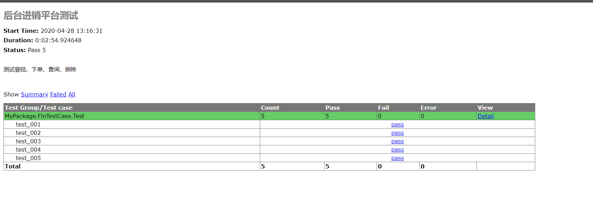

# 驱动安装
+ 百度谷歌 下载火狐谷歌驱动
+ 放置python根目录
#  selenium测试经销后台
## 整体架构

如图所示，整体架构为四大板块，`testCasehtml.py`复制整合所有测试套件并输出html测试文档，`finTest.py`中定义了所有测试方法，`FinTestCase.py`则进行对方法的调用并测试，而`MyCommonLib.py`是为底层方法提供支持
## finTest.py
###  login()
```python
    # 登陆
    def login(self, user, pwd):
        self.open_url("http://wewopa.natapp4.cc/jinxiaocun/")
        self.ActionChain("xpath", "/html/body/div/div[2]/form/table/tbody/tr[2]/td[2]/input", user)
        self.ActionChain("xpath", "/html/body/div/div[2]/form/table/tbody/tr[3]/td[2]/input", pwd)
        self.click("xpath", "/html/body/div/div[2]/form/table/tbody/tr[4]/td/input")
        time.sleep(3)
        data = self.get_text("class", "right_header")
        print(data)
        self.driver.switch_to.default_content()
```
对用户名和密码进行定位并输入账号密码进行登录
**针对有的浏览器会自动填写用户名密码，所以底层ActionChain()代码的click改成了double_click**

```python
    def ActionChain(self, locate_type, value, data):
        el = self.locateElement(locate_type, value)
        # 有的浏览器有自动输入，使用double_click就可以覆盖
        ActionChains(self.driver).double_click(el).send_keys(data).perform()
        time.sleep(3)
```

#####  代码过长后面的都不贴了

###  order()
是针对一开始的下单页面进行的测试
###  search()
是对库存的查询测试
```
s1 = Select(self.locateElement("xpath", '//*[@id="sName"]'))
s1.select_by_visible_text("银月城")
```
此处引用了Select()方法，实例了一个对象，用于选取select选框中的内容

###  delete()
是对客户管理的删除测试
```python
data = self.get_text('xpath', '/html/body/table/tbody/tr[4]/td[1]')
return data
```
此处代码返回了个data，用于对删除后的数据进行一个比较，来判断是否删除成功
###  add()
是对员工的添加进行测试

## FinTestCase.py
* 调用finTest()的方法进行测试
* 使用页面数据进行对比来判断是否测试成功
* 对于delete页面没有做员工唯一值的地方就不执行关闭浏览器操作，用于人工判断

## testCasehtml.py
* 执行指定测试用例并输出html测试文档

最后测试文档生成如下，因网页数据传输稳定性而会有测试偏差

